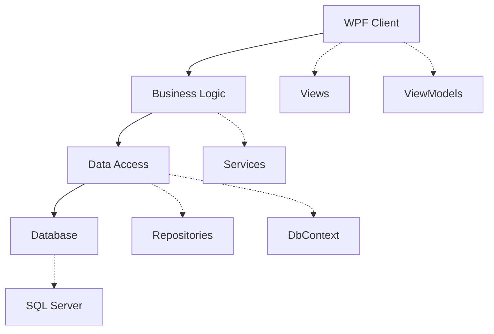

```mermaid
graph TD
    WPF_Client["WPF Client"] --> Business_Logic["Business Logic"]
    Business_Logic --> Data_Access["Data Access"]
    Data_Access --> Database["Database"]
    
    WPF_Client -.-> Views[Views]
    WPF_Client -.-> ViewModels[ViewModels]
    Business_Logic -.-> Services[Services]
    Data_Access -.-> Repositories[Repositories]
    Data_Access -.-> DbContext[DbContext]
    Database -.-> SQL_Server["SQL Server"]
```
