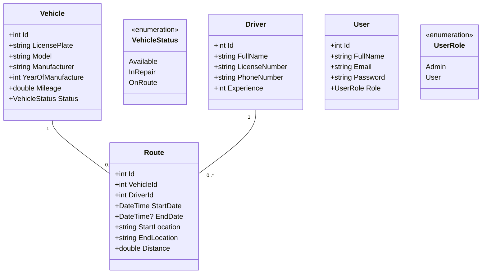

```mermaid
classDiagram
    class Vehicle {
        +int Id
        +string LicensePlate
        +string Model
        +string Manufacturer
        +int YearOfManufacture
        +double Mileage
        +VehicleStatus Status
    }

    class VehicleStatus {
        <<enumeration>>
        Available
        InRepair
        OnRoute
    }

    class Driver {
        +int Id
        +string FullName
        +string LicenseNumber
        +string PhoneNumber
        +int Experience
    }

    class User {
        +int Id
        +string FullName
        +string Email
        +string Password
        +UserRole Role
    }

    class UserRole {
        <<enumeration>>
        Admin
        User
    }

    class Route {
        +int Id
        +int VehicleId
        +int DriverId
        +DateTime StartDate
        +DateTime? EndDate
        +string StartLocation
        +string EndLocation
        +double Distance
    }

    Vehicle "1" -- "0..*" Route
    Driver "1" -- "0..*" Route
```
