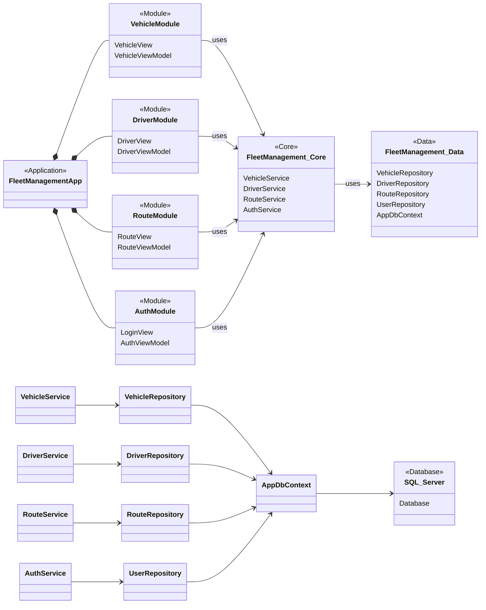

```mermaid
classDiagram
    direction LR
    
    %% Основные компоненты как классы со стереотипами
    class FleetManagementApp {
        <<Application>>
    }
    
    class VehicleModule {
        <<Module>>
        VehicleView
        VehicleViewModel
    }
    
    class DriverModule {
        <<Module>>
        DriverView
        DriverViewModel
    }
    
    class RouteModule {
        <<Module>>
        RouteView
        RouteViewModel
    }
    
    class AuthModule {
        <<Module>>
        LoginView
        AuthViewModel
    }
    
    class FleetManagement_Core {
        <<Core>>
        VehicleService
        DriverService
        RouteService
        AuthService
    }
    
    class FleetManagement_Data {
        <<Data>>
        VehicleRepository
        DriverRepository
        RouteRepository
        UserRepository
        AppDbContext
    }
    
    class SQL_Server {
        <<Database>>
        Database
    }
    
    %% Группировка
    FleetManagementApp *-- VehicleModule
    FleetManagementApp *-- DriverModule
    FleetManagementApp *-- RouteModule
    FleetManagementApp *-- AuthModule
    
    %% Связи между компонентами
    VehicleModule --> FleetManagement_Core : uses
    DriverModule --> FleetManagement_Core : uses
    RouteModule --> FleetManagement_Core : uses
    AuthModule --> FleetManagement_Core : uses
    
    FleetManagement_Core --> FleetManagement_Data : uses
    
    VehicleService --> VehicleRepository
    DriverService --> DriverRepository
    RouteService --> RouteRepository
    AuthService --> UserRepository
    
    VehicleRepository --> AppDbContext
    DriverRepository --> AppDbContext
    RouteRepository --> AppDbContext
    UserRepository --> AppDbContext
    
    AppDbContext --> SQL_Server
```
