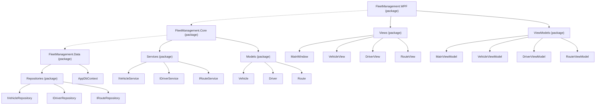

```mermaid
graph TD
    FleetManagement.WPF["FleetManagement.WPF (package)"]
    Views["Views (package)"]
    ViewModels["ViewModels (package)"]
    
    FleetManagement.Core["FleetManagement.Core (package)"]
    Services["Services (package)"]
    Models["Models (package)"]
    
    FleetManagement.Data["FleetManagement.Data (package)"]
    Repositories["Repositories (package)"]
    AppDbContext
    
    FleetManagement.WPF --> Views
    FleetManagement.WPF --> ViewModels
    Views --> MainWindow
    Views --> VehicleView
    Views --> DriverView
    Views --> RouteView
    ViewModels --> MainViewModel
    ViewModels --> VehicleViewModel
    ViewModels --> DriverViewModel
    ViewModels --> RouteViewModel
    
    FleetManagement.Core --> Services
    FleetManagement.Core --> Models
    Services --> IVehicleService
    Services --> IDriverService
    Services --> IRouteService
    Models --> Vehicle
    Models --> Driver
    Models --> Route
    
    FleetManagement.Data --> Repositories
    FleetManagement.Data --> AppDbContext
    Repositories --> IVehicleRepository
    Repositories --> IDriverRepository
    Repositories --> IRouteRepository
    
    FleetManagement.WPF -.-> FleetManagement.Core
    FleetManagement.Core -.-> FleetManagement.Data
```
