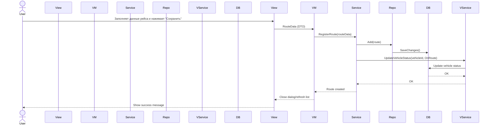

```mermaid
sequenceDiagram
    actor User
    participant RouteView as View
    participant RouteViewModel as VM
    participant RouteService as Service
    participant RouteRepository as Repo
    participant VehicleService as VService
    participant AppDbContext as DB

    User->>View: Заполняет данные рейса и нажимает "Сохранить"
    View->>VM: RouteData (DTO)
    VM->>Service: RegisterRoute(routeData)
    Service->>Repo: Add(route)
    Repo->>DB: SaveChanges()
    Service->>VService: UpdateVehicleStatus(vehicleId, OnRoute)
    VService->>DB: Update vehicle status
    DB-->>VService: OK
    VService-->>Service: OK
    Service-->>VM: Route created
    VM-->>View: Close dialog/refresh list
    View-->>User: Show success message
```
